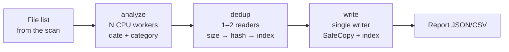

# Architecture

**English** · [Русский](ru/architecture.md)

[← Building](build.md) · [Back to README](../README.md)

Go 1.25 + [Wails v2](https://wails.io) (a window on the system WebView, UI in Svelte 5 + TypeScript). The whole core lives in `internal/` and does not depend on the UI.

## Packages

| Package | Purpose |
|---|---|
| `main` (`main.go`, `app.go`) | window startup; methods exposed to the UI; `scan:*`, `archive:*`, `reindex:*` events |
| `internal/scanner` | walks the sources, picks photos and videos, collects stats; system folders are skipped |
| `internal/media` | file type by extension, unknown files by signature |
| `internal/metadata` | capture date: EXIF (`imagemeta`), `mvhd` in MP4/MOV (`go-mp4`), `ffprobe`, file name, mtime |
| `internal/classify` | rules + CLIP via `onnxruntime_go`; result is photo or picture |
| `internal/hashing` | BLAKE3, 1 MB buffers, read speed limiting |
| `internal/fsutil` | safe copy, no-replace rename, free space, file names |
| `internal/index` | SQLite archive index (`modernc.org/sqlite`, no cgo): files, runs, journal |
| `internal/archiver` | archiving pipeline, progress, reports, cross-archive duplicates, space estimate |
| `internal/priority` | low CPU/disk priority, load profiles |
| `internal/drives` | drive list (Linux: `/proc/self/mounts`, Windows: `GetLogicalDrives`) |
| `internal/layout` | archive structure (`Фото/Видео/Картинки/Без даты` — Photos/Videos/Pictures/No date) |
| `internal/systheme` | light or dark OS color scheme (Linux: `gsettings`, `kdeglobals`, GTK theme; Windows: registry) |
| `internal/i18n` | UI language from the OS locale (Linux: `LANGUAGE`/`LC_ALL`/`LC_MESSAGES`/`LANG`; Windows: preferred UI language) and `Pick(ru, en)` for backend messages |
| `internal/config`, `internal/logging` | settings (`settings.json`) and logs (`slog` + rotation) |

## Archiving pipeline

- Stages are connected by bounded channels, so memory stays flat even with millions of files.
- **Duplicate check.** If no archive has a file of the same size, the hash is computed while copying and the file is read only once. If the size matches, the source hash is computed first and looked up in the index. Before publishing a copy, the writer checks the hash once more, which catches identical files within a single source.
- **The index is checked against the disk.** An index match only counts as a duplicate if the file is actually present at its recorded path. If it was deleted by hand, the file is archived again and the stale record is removed from the index (records in other archives, which are opened read-only, are left alone). If the file exists but cannot be read (permissions, I/O error), it is still treated as a duplicate to avoid a second copy.
- **Single writer.** Files are written sequentially, which is gentlest on HDDs.
- **Space reserve.** Before each file is written, the writer checks that at least 1 GiB (`archiver.ReserveBytes`) will remain free afterwards; otherwise the run stops.
- **Pause** halts the stages between files. **Cancel** rolls back the current `.part`.
- Progress is sent to the UI at most 10 times per second.
- Files located inside the archive folder itself are excluded: the archive never archives itself.

## Safe writes (`fsutil.SafeCopy`)

1. `.memoryarchive/tmp/<random>.part` is opened with `O_EXCL`; the file is copied while its hash is computed.
2. `fsync`. If the source hash was known in advance, it is compared to detect a file that changed while being read.
3. If verification is on, the file is re-read and its hash compared.
4. Duplicate check (`Accept`). Then an atomic **no-replace** rename: `renameat2(RENAME_NOREPLACE)` on Linux with a `link` fallback, `MoveFileEx` without `REPLACE_EXISTING` on Windows. If the name is taken, `name_1`, `name_2` and so on are tried.
5. `fsync` of the directory (Linux).

Disk errors (ENOSPC, EIO, EROFS, `ERROR_DISK_FULL` and similar) are fatal and stop the whole run. Source read errors only skip that file.

## Index and journal

`<archive>/.memoryarchive/index.db` (WAL):

- `files(hash PK, size, rel_path, kind, category, year, date_source, orig_name, added_at)`: the archive catalog, indexed by size;
- `runs`: run history with statistics;
- `journal`: `pending → written → done` states for every copy. On startup, `written` entries (file already in the archive but not in the index) are recovered, other unfinished entries are marked `failed`, and leftover `.part` files are deleted.

If there is no index but the archive contains files, the "Build index" button recomputes the hashes (`index.Reindex`).

## Duplicates across archives

There is no manual setting for other archive drives. The list of archives to check is assembled before every run:

- `knownArchives` from the settings: every archive a real (non-dry) run has written to is remembered automatically (newest first, at most 50). The legacy `otherArchives` and `lastDestination` keys are merged into this list when the settings are loaded;
- archives at the root of connected drives (those with `.memoryarchive/index.db`).

Their indexes are opened read-only. Disconnected drives and folders without an index are skipped silently.

## Destination screen

`GetDestinationInfo` does not modify the folder and returns:

- free space on the drive;
- how many files and bytes will be copied (`archiver.EstimateNeeded`): a file is excluded if the index has a file of the same size and that file is physically on disk. The estimate is size-based, so it is an upper bound. The 1 GiB reserve is not included here but is taken into account by the "enough space" flag;
- statistics for the files physically present in the `Фото`, `Видео`, `Картинки`, `Без даты` folders (not the index): count, size, years.

## Classification

1. **Rules** (`classify/heuristic.go`), without decoding pixels:
   - RAW, HEIC, or EXIF with a camera model → photo;
   - SVG, ICO, images smaller than 256 px, PNG/GIF/WebP with transparency, GIF → picture;
   - a "Screenshot…"/"Снимок экрана…" file name or a PNG at a screen resolution → picture, but CLIP checks for people in the shot (people labels ≥ 0.5 → photo).
2. **CLIP** for ambiguous JPEG, PNG, WebP, BMP and TIFF. The image is center-cropped to a square and scaled to 224×224, and its embedding is compared with precomputed embeddings of 18 categories. If the summed probability of the "picture" group reaches the threshold (0.5 by default), the file goes to pictures, otherwise to photos. Exception: if the people labels (`person`, `people`, `child`, `driver`) score ≥ 0.25 and "picture" is below 0.9, the file stays in photos, so casual photos of people are not filed as a "banner" or "screenshot". Inference is limited to the load profile's thread count.
3. No model, or an image larger than 100 MP → photo. A CLIP error → the rules' decision, or photo if there is none. This is the safer choice for personal photos.

Videos always go to videos.

## User interface

- **Theme.** While `theme` is `auto`, the UI asks for the OS color scheme once (`SystemTheme` → `internal/systheme`) and applies it. If that call fails, the WebView's `prefers-color-scheme` is used. The button in the top-right corner toggles light/dark and saves the choice.
- **Language.** English or Russian is picked once at startup from the OS locale (Russian only on a Russian system): the UI calls `GetLanguage` (`internal/i18n`) before mounting and falls back to `navigator.language`. UI strings are written inline as `tr('русский', 'English')` (`frontend/src/lib/i18n.ts`); backend messages use `i18n.Pick`. Archive folder names do not depend on the language.
- **Wizard.** After a real run the selected sources are cleared; "New archive" resets sources, scan results and report. The last three sources are remembered.

## Load

| Level | CPU workers | Readers | Speed limit | Priority |
|---|---|---|---|---|
| Low | 1 | 1 | 40 MB/s | nice 10 + I/O idle (Linux), background mode (Windows) |
| Medium | min(4, cores/2) | 1 | — | nice 10 + I/O best-effort 7 |
| High | cores−1 | 2 | — | nice 10 + I/O best-effort 7 |

On Linux, priority is applied to every thread of the process (`/proc/self/task`), and new threads inherit it.

## See also

- [Configuration and files](configuration.md): settings, load levels, logs
- [Building](build.md): building, the CLIP model, tests
