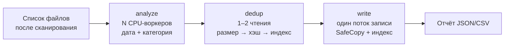

# Архитектура

[English](../architecture.md) · **Русский**

[← Сборка](build.md) · [Назад к README](../../README.ru.md)

Go 1.25 + [Wails v2](https://wails.io) (окно на системном WebView, интерфейс на Svelte 5 + TypeScript). Всё ядро лежит в `internal/` и не зависит от интерфейса.

## Пакеты

| Пакет | Назначение |
|---|---|
| `main` (`main.go`, `app.go`) | запуск окна; методы для интерфейса; события `scan:*`, `archive:*`, `reindex:*` |
| `internal/scanner` | обход источников, отбор фото и видео, статистика; системные папки пропускаются |
| `internal/media` | тип файла по расширению, неизвестные — по сигнатуре |
| `internal/metadata` | дата съёмки: EXIF (`imagemeta`), `mvhd` в MP4/MOV (`go-mp4`), `ffprobe`, имя файла, mtime |
| `internal/classify` | правила + CLIP через `onnxruntime_go`; итог — «Фото» или «Картинки» |
| `internal/hashing` | BLAKE3, буферы 1 МБ, ограничение скорости чтения |
| `internal/fsutil` | безопасное копирование, переименование без замены, свободное место, имена файлов |
| `internal/index` | SQLite-индекс архива (`modernc.org/sqlite`, без cgo): файлы, запуски, журнал |
| `internal/archiver` | конвейер архивации, прогресс, отчёты, дубли между архивами, оценка места |
| `internal/priority` | низкий приоритет CPU/диска, профили нагрузки |
| `internal/drives` | список дисков (Linux: `/proc/self/mounts`, Windows: `GetLogicalDrives`) |
| `internal/layout` | структура архива (`Фото/Видео/Картинки/Без даты`) |
| `internal/systheme` | светлая или тёмная тема системы (Linux: `gsettings`, `kdeglobals`, тема GTK; Windows: реестр) |
| `internal/i18n` | язык интерфейса по локали системы (Linux: `LANGUAGE`/`LC_ALL`/`LC_MESSAGES`/`LANG`; Windows: язык интерфейса пользователя) и `Pick(ru, en)` для сообщений бэкенда |
| `internal/config`, `internal/logging` | настройки (`settings.json`) и логи (`slog` + ротация) |

## Конвейер архивации

- Стадии связаны каналами с ограниченным буфером, так что память не растёт на миллионах файлов.
- **Проверка дублей.** Если файла такого размера в архивах нет, хэш считается во время копирования, и файл читается один раз. Если размер совпал, сначала считается хэш источника и ищется в индексе. Перед публикацией копии поток записи ещё раз сверяет хэш: так ловятся одинаковые файлы внутри одного источника.
- **Индекс сверяется с диском.** Совпадение в индексе считается дублем, только если файл по записанному пути действительно лежит в архиве. Если его удалили вручную, файл архивируется заново, а устаревшая запись удаляется из индекса (в других архивах, открытых только для чтения, записи не трогаются). Если файл есть, но недоступен (права, ошибка ввода-вывода), он по-прежнему считается дублем, чтобы не создать вторую копию.
- **Один поток записи.** Запись идёт последовательно, это бережнее всего для HDD.
- **Запас места.** Перед записью каждого файла проверяется, что после неё на диске останется не меньше 1 ГиБ (`archiver.ReserveBytes`); иначе запуск останавливается.
- **Пауза** останавливает стадии между файлами. **Отмена** откатывает текущий `.part`.
- Прогресс отправляется в интерфейс не чаще 10 раз в секунду.
- Файлы, лежащие внутри самой папки архива, из списка исключаются: архив не архивирует сам себя.

## Безопасная запись (`fsutil.SafeCopy`)

1. `.memoryarchive/tmp/<random>.part` открывается с `O_EXCL`, копирование идёт с одновременным подсчётом хэша.
2. `fsync`. Если хэш источника был известен заранее, он сверяется, чтобы заметить изменение файла во время чтения.
3. При включённой проверке файл перечитывается, хэш сравнивается.
4. Проверка на дубль (`Accept`). Затем атомарное переименование **без замены**: Linux `renameat2(RENAME_NOREPLACE)` с запасным вариантом через `link`, Windows `MoveFileEx` без `REPLACE_EXISTING`. Если имя занято, пробуются `имя_1`, `имя_2` и т. д.
5. `fsync` каталога (Linux).

Ошибки диска (ENOSPC, EIO, EROFS, `ERROR_DISK_FULL` и т. п.) считаются фатальными и останавливают весь запуск. Ошибки чтения источника только пропускают этот файл.

## Индекс и журнал

`<архив>/.memoryarchive/index.db` (WAL):

- `files(hash PK, size, rel_path, kind, category, year, date_source, orig_name, added_at)`: каталог архива, индекс по размеру;
- `runs`: история запусков со статистикой;
- `journal`: состояния `pending → written → done` для каждой копии. При старте записи `written` (файл уже в архиве, но не в индексе) восстанавливаются, остальные незавершённые помечаются `failed`, а оставшиеся `.part` удаляются.

Если индекса нет, а файлы в архиве есть, кнопка «Построить индекс» пересчитывает хэши (`index.Reindex`).

## Дубли между архивами

Ручной настройки других архивных дисков нет. Список архивов для проверки собирается перед каждым запуском:

- `knownArchives` из настроек: каждый архив, в который прошла настоящая (не пробная) архивация, запоминается автоматически (новые первыми, не больше 50). Старые поля `otherArchives` и `lastDestination` вливаются в этот список при загрузке настроек;
- архивы в корне подключённых дисков (есть `.memoryarchive/index.db`).

Их индексы открываются только для чтения. Отключённые диски и папки без индекса тихо пропускаются.

## Экран «Назначение»

`GetDestinationInfo` ничего не меняет в папке и возвращает:

- свободное место на диске;
- сколько файлов и байт будет скопировано (`archiver.EstimateNeeded`): файл не считается, если в индексе есть файл того же размера и он физически лежит на диске. Оценка по размеру, поэтому это верхняя граница. Запас 1 ГиБ сюда не входит, но учитывается в признаке «места хватает»;
- статистику по файлам, которые физически лежат в папках `Фото`, `Видео`, `Картинки`, `Без даты` (а не по индексу): количество, объём, годы.

## Классификация

1. **Правила** (`classify/heuristic.go`) без декодирования пикселей:
   - RAW, HEIC или EXIF с моделью камеры → «Фото»;
   - SVG, ICO, картинка меньше 256 px, PNG/GIF/WebP с прозрачностью, GIF → «Картинки»;
   - имя «Screenshot…»/«Снимок экрана…» или PNG с разрешением экрана → «Картинки», но CLIP проверяет, нет ли на снимке людей (вероятность меток с людьми ≥ 0,5 → «Фото»).
2. **CLIP** для спорных JPEG, PNG, WebP, BMP и TIFF. Изображение обрезается по центру до квадрата и уменьшается до 224×224, вектор изображения сравнивается с заранее посчитанными векторами 18 категорий. Если сумма вероятностей группы «картинки» не меньше порога (0,5 по умолчанию), файл идёт в «Картинки», иначе в «Фото». Исключение: если метки с людьми (`person`, `people`, `child`, `driver`) набрали ≥ 0,25, а «картинки» < 0,9, файл остаётся в «Фото» — так любительские фото людей не уходят в «Картинки» как «баннер» или «скриншот». Инференс ограничен числом потоков профиля нагрузки.
3. Нет модели или изображение больше 100 Мп → «Фото». Ошибка CLIP → решение правил, а если его нет — «Фото». Это безопаснее для личных снимков.

Видео всегда попадают в «Видео».

## Интерфейс

- **Тема.** При `theme` = `auto` интерфейс один раз запрашивает тему системы (`SystemTheme` → `internal/systheme`) и применяет её. Если определить не удалось, используется `prefers-color-scheme` из WebView. Кнопка в правом верхнем углу переключает светлую и тёмную тему и сохраняет выбор.
- **Язык.** Русский или английский выбирается один раз при запуске по языку системы (русский — только для русской системы): интерфейс вызывает `GetLanguage` (`internal/i18n`) до монтирования, запасной вариант — `navigator.language`. Строки интерфейса записаны прямо в коде как `tr('русский', 'English')` (`frontend/src/lib/i18n.ts`), сообщения бэкенда — через `i18n.Pick`. Имена папок архива от языка не зависят.
- **Мастер.** После настоящей архивации выбранные источники сбрасываются; «Новая архивация» сбрасывает источники, результаты сканирования и отчёт. Запоминаются три последних источника.

## Нагрузка

| Уровень | CPU-воркеры | Чтения | Лимит скорости | Приоритет |
|---|---|---|---|---|
| Низкая | 1 | 1 | 40 МБ/с | nice 10 + I/O idle (Linux), background mode (Windows) |
| Средняя | min(4, ядра/2) | 1 | — | nice 10 + I/O best-effort 7 |
| Высокая | ядра−1 | 2 | — | nice 10 + I/O best-effort 7 |

На Linux приоритет выставляется всем потокам процесса (`/proc/self/task`), новые потоки его наследуют.

## См. также

- [Настройки и файлы](configuration.md): параметры, уровни нагрузки, логи
- [Сборка](build.md): сборка, модель CLIP, тесты
